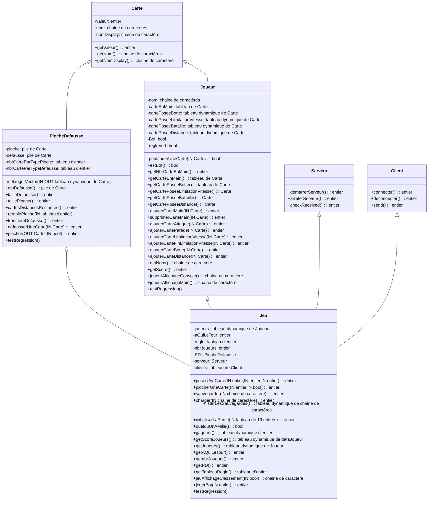

# MilleBournes

## Projet de LIFAP4 Conception et Developpement d'Applications

<https://perso.liris.cnrs.fr/alexandre.meyer/public_html/www/doku.php?id=lifap4>

<https://perso.liris.cnrs.fr/alexandre.meyer/public_html/www/doku.php?id=lifap4_regles>

## Diagramme de classes


## Déroulement du jeu

Après avoir renseigné son nom, on choisit le nombre de joueurs (entre 2 et 4) et le choix des règles (par défault ou non). Ensuite, on peut choisir de modifier le paquet en appuyant sur 'p', de commencer une partie en appuyant sur 'n' ou de quitter en appuyant sur 'e'.
Lorsqu'on commence une nouvelle partie, on se retrouve devant un plateau où les adversaires sont en rouge, et notre partie est en vert.
Lorsque c'est notre tour, on clique une fois sur la carte qu'on veut jouer, elle sera indiquée avec un encadrement bleu. 
Puis on clique sur la cible qui peut être :
    - Nous même (pour les cartes de type feu vert, borne, etc). Dans ce cas, on clique dans notre partie verte.
    - Un adversaire (pour les cartes de type attaque). Dans ce cas, il faut cliquer dans la partie rouge de l'adversaire qu'on veut attaquer.
    - La défausse. Dans ce cas, on clique dans la partie blanche en bas à droite.

Si un des joueurs atteint 1000 kilometres, le jeu affiche son nom. S'il n'y a plus de cartes dans la pioche, ni dans la défausse, le jeu affiche le classement des gagnants en fonction du nombre de kilometres parcourus.
On est redirigé ensuite sur la page du menu.

Regles adaptables:
Si on choisit de pouvoir piocher dans la defausse il faut cliquer soit sur la carte retournée de la pioche soit sur la dernière carte posée dans la defausse au milieu du jeu.
On peut aussi décider de ne pas avoir à poser une carte feu vert après une carte parade.


## Description

Ce jeu est un Mille-Borne like,
Ce projet compile 3 exécutables dans le dossier bin: milleEtUneBorneConsole, milleEtUneBorneSDL, testRegression
Les sources du code sont dans le dossier src
Les sources du code des classes principales sont dans le dossier src/core,
La source du code pour le fichier de l'executable testRegression se trouve dans le dossier src/,
Les sources du code pour l'affichage console se trouve dans le dossier src/console,
Les sources du code pour l'affichage graphique se trouve dans le dossier src/sdl,
Les images utilisées se trouvent dans le dossier data,
Le fichier de config de doxygen se trouve dans le dossier doc

### Pré-requis

Il faut installer/ avoir d'installé ces libs SDL2 SDL2_ttf SDL2_image:

```bash
sudo apt install libsdl2-dev libsdl2-ttf-dev libsdl2-image-dev
```

### Test

Les tests de régression peuvent être executé avec la commande suivante:

```bash
./bin/testRegression
```

## Auteurs

- **Benjamin Forissier**
- **Emie Lafourcade**
- **Judith Millet**
- **Antoine Rybacki**
