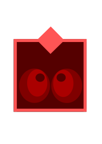

# Projet Roborally

Ce projet vise à créer un joueur automatique pour le jeu [Roborally](https://fr.wikipedia.org/wiki/RoboRally). 
Le sujet est disponible en pdf [sur la page du cours](https://liris.cnrs.fr/vincent.nivoliers/lifap6/Supports/Projet/roborally.pdf).

### La mascotte du projet:


## Description

Ce projet comporte une structure de données de type ```std::unordered_map<RR::Robot, RobotArId, RobotHash>``` afin de stocker le graphe du jeu, un algorithme de calcul du plus court chemin nommé **Dijkstra** utilisant la STL (avec du poids selon l'action), ainsi qu'un programme permettant de faire jouer un joueur artificiel.

## Test

Compilez depuis roborally-etu/Src/ avec la commande suivante :

```bash
make
```
Les tests sont réalisés grace à la commande suivante :

```bash
./artificial_player
```

Puis vous pouvez visualiser le graphe avec la commande suivante :

```bash
./app board.txt
```


## Auteurs

- **Judith Millet**
- **Antoine Rybacki**